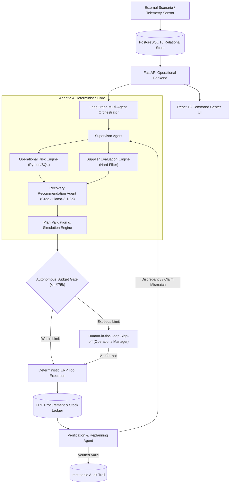

# Autonomous Supply Chain Disruption Control Platform
**Tata Motors Operations | Autonomous Supply Chain Recovery Agent**

> **Core Principle**: *LLMs recommend and reason. Deterministic services establish operational truth. Humans authorize. Deterministic tools execute.*

---

## 1. Project Overview

In automotive assembly lines, component shortages cause catastrophic manufacturing halts costing up to ₹350,000 per hour in idle capacity losses. Traditional Enterprise Resource Planning (ERP) databases are static—they record disruptions after the fact, cannot autonomously evaluate multi-vendor constraint matrices, fail to catch unverified carrier tracking claims, and lack the adaptive intelligence to re-sequence production orders during emergency stockouts.

We built an **Autonomous Supply Chain Disruption Controller** designed to maintain automotive manufacturing continuity. When an inbound shipment delay, physical warehouse inventory mismatch, or supplier quality constraint occurs, the platform autonomously investigates the root cause, calculates stockout timelines, requests quotes from qualified regional suppliers, and formulates mathematically feasible recovery plans.

Unlike simple chatbots or static dashboard monitoring tools, our platform features a **closed-loop LangGraph multi-agent architecture** paired with **deterministic mathematical engines**. AI agents handle contextual reasoning, operational trade-off analysis, and supplier negotiation, while deterministic Python/SQL services enforce hard constraints (ISO-9001 certifications, AQL tolerances, and inventory balances).

When a disruption strikes, the system calculates exact line-stop countdowns, filters candidate suppliers, generates recovery purchase orders or production schedule adjustments, gates high-value expenditures (> ₹75,000) for Operations Manager sign-off, commits verified actions to the simulated ERP, and continuously cross-verifies carrier tracking telemetry.

---

## 2. Key Capabilities

| Capability | What the System Does |
| :--- | :--- |
| **Disruption Detection** | Real-time sensor scanning detects supplier delivery delays, consumption spikes, and inventory breaches $< 250\text{ms}$. |
| **Inventory & Risk Analysis** | Deterministically computes usable stock, 7d/30d burn rate trends, days of coverage, and hours to plant line stoppage. |
| **Supplier Evaluation** | Enforces hard constraint filters (ISO-9001 / IATF-16949 validity, AQL levels) and scores suppliers via weighted multi-criteria logic. |
| **Recovery Planning** | Formulates optimal recovery actions: expedited single-sourcing, multi-vendor split sourcing, or production order re-sequencing. |
| **Human Approval Gate** | Enforces an immutable Human-in-the-Loop (HITL) gate for plans exceeding autonomous budget ceilings (₹75,000 threshold). |
| **ERP Execution** | Atomically dispatches approved purchase orders to PostgreSQL procurement ledgers with optimistic concurrency locking. |
| **Verification & Replanning**| Cross-references supplier dispatch claims against live carrier tracking APIs; automatically triggers adaptive replanning on discrepancy. |
| **Auditability** | Permanently records an immutable, timestamped audit trail of every sensor trigger, engine calculation, LLM output, and human sign-off. |

---

## 3. Why It Is Agentic

- **Stateful Multi-Step Orchestration**: LangGraph coordinates a resilient agent loop (`SupervisorAgent` &rarr; `OperationalRiskEngine` &rarr; `SupplierEvaluationEngine` &rarr; `RecoveryRecommendationAgent` &rarr; `VerificationReplanningAgent`).
- **Separation of LLM Reasoning & Deterministic Truth**:
  - **LLM Responsibilities**: Qualitative operational rationale, trade-off explanation, adaptive strategy formulation, and supplier communication.
  - **Deterministic Responsibilities**: Stock balances, burn rate math, ISO certification hard gates, pricing calculations, and database commits.
- **Contextual Tool Selection**: Agents dynamically query database tools (`calculate_risk`, `filter_suppliers`, `simulate_plan`, `create_purchase_order`, `verify_execution`).
- **Human-in-the-Loop Authority**: High-risk financial commitments require authenticated Operations Manager approval before any mutating tool executes.
- **Closed-Loop Verification & Replanning**: Post-execution state is audited against expected telemetry. If carrier tracking contradicts supplier claims or stockout risks persist, the agent initiates secondary replanning.

---

## 4. Architecture



- **FastAPI Operational Backend**: Serves REST endpoints for real-time disruption ingestion, inventory telemetry, and approval commands.
- **PostgreSQL 16 Relational Store**: The single source of operational truth for components, supplier certifications, POs, and audit logs.
- **LangGraph Multi-Agent Orchestrator**: Coordinates deterministic engines and LLM reasoning steps with LangSmith observability.
- **Deterministic Business Engines**: Perform mathematical risk scoring, hard constraint compliance checks, and Monte Carlo what-if simulations.
- **Human-in-the-Loop Checkpoint**: Prevents unauthorized financial commitments without authenticated manager sign-off.
- **Verification & Replanning Agent**: Audits carrier waybills post-execution to detect unverified supplier claims and trigger replanning loops.
- **React 18 Control Tower**: Industrial dark-mode operations interface providing live telemetry gauges, incident dossiers, and Scenario Lab controls.

---

## 5. End-to-End Workflow

```text
[Disruption Ingested] → [Risk & Coverage Analysis] → [Evaluate Qualified Suppliers] 
       → [Formulate Recovery Plan] → [Deterministic Simulation & Budget Check] 
       → [Human Approval Gate] → [ERP Commit] → [Closed-Loop Verification] → [Resolved / Replanned]
```

When an event is detected, the system calculates stockout timelines and queries regional supplier capacity. Non-compliant suppliers (failing ISO/AQL standards) are deterministically rejected. The Recovery Agent generates an optimized recovery plan (or split sourcing allocation). If the cost exceeds ₹75,000, execution pauses for manager sign-off. Once authorized, the recovery PO commits to the ERP, carrier tracking is verified, and the full event lifecycle is permanently sealed in the audit ledger.

---

## 6. Six Official Scenarios

All 6 official benchmark scenarios are implemented and 100% verified via automated integration suites:

| Scenario | Expected System Behavior | Status |
| :--- | :--- | :---: |
| **1. Normal Disruption** | Detects 5-day delay on `PO-7712`; evaluates regional suppliers; selects certified `SUP-34`; executes recovery PO. | **`PASS`** |
| **2. Stale Inventory Data** | Flags 51.2% ERP vs physical stock gap; recalculates coverage to true usable units; escalates to `CRITICAL`. | **`PASS`** |
| **3. Adversarial Supplier Claim** | Catches contradiction between supplier dispatch claim and carrier tracking (`NO_PICKUP`); triggers replanning. | **`PASS`** |
| **4. Quality Constraint** | Deterministic hard filter rejects cheapest uncertified supplier (`SUP-21`); awards recovery to certified `SUP-34`. | **`PASS`** |
| **5. Budget Approval Gate** | Recovery plan ₹96,000 exceeds ₹75,000 limit; halts autonomous execution; generates decision brief for manager sign-off. | **`PASS`** |
| **6. High-Pressure Production Risk**| Plant halt in 9.6h; re-sequences production queue to order `PROD-882`; executes multi-supplier split sourcing. | **`PASS`** |

---

## 7. Product / UI

The application features a minimal industrial command-center aesthetic (`#12161C` base, `#003DA5` Tata Blue accents, `#1E242C` surface cards):

- **Control Tower / Home**: Executive overview featuring active disruption KPI counters, critical incident matrices, and operational risk summaries.
- **Disruption Report / Dossier**: Sequential 9-step demo flow walkthrough and complete 10-feature MVP capabilities suite with prominent approve/reject actions.
- **Communications Inbox**: Inbound disruption alerts, supplier delay notices, and automated RFQ confirmation transcripts.
- **Inventory & Coverage**: Live usable stock balances, safety stock thresholds, and 7d/30d moving average consumption trends.
- **Purchase Orders**: Live tracking of active and recovery POs with optimistic concurrency protection.
- **Suppliers**: Database of supplier profiles, ISO certifications, AQL tolerance ratings, and persistent reliability memory scores.
- **Audit Trail**: Chronological, immutable decision ledger recording every sensor trigger, engine score, and human authorization.
- **Scenario Lab**: Interactive injection control interface that triggers real database state changes and LangGraph agent workflows, seamlessly updating the live UI.

---

## 8. Technology Stack

| Layer | Technology |
| :--- | :--- |
| **Frontend UI** | React 18, Vite 5, Vanilla CSS (Industrial Command-Center Design System), React Router 6 |
| **Backend API** | FastAPI (Python 3.13), Uvicorn, Pydantic v2, SQLAlchemy 2.0 Async, AsyncPG |
| **Agent Orchestration**| LangGraph, LangChain Core, LangSmith Tracing |
| **LLM Provider** | Groq API (`llama-3.1-8b-instant`), deterministic fallback engine |
| **Database** | PostgreSQL 16 (Relational store with ACID transactions and row-level locking) |
| **Infrastructure** | Docker, Docker Compose, Nginx Alpine, Docker Hub (`nimish1106/...`) |
| **Testing** | PyTest (20/20 integration and scenario tests passing) |

---

## 9. Running the Project

### Prerequisites
- Docker & Docker Compose installed.

### Quick Start (Prebuilt Docker Hub Images)
```bash
# 1. Clone the repository
git clone https://github.com/omkarP-bit/Supply-Chain-Ops.git
cd Supply-Chain-Ops

# 2. Setup environment variables
cp .env.example .env

# 3. Pull and launch containers
docker compose pull
docker compose up -d

# 4. Open in browser
# Frontend: http://localhost:5173
# Backend Health: http://localhost:8000/health
```

### Local Python & Vite Development
```bash
# Start PostgreSQL container
docker run -d --name scops-postgres -e POSTGRES_USER=scops -e POSTGRES_PASSWORD=scops_secret -e POSTGRES_DB=supply_chain -p 5433:5432 postgres:16

# Backend
cd backend && pip install -r requirements.txt
uvicorn app.main:app --reload --port 8000

# Frontend
cd frontend && npm install && npm run dev
```

---

## 10. Recommended Demo Flow for Judges

1. **Open Control Tower** ([`http://localhost:5173`](http://localhost:5173)): View baseline operations and healthy KPIs.
2. **Navigate to Scenario Lab** ([`http://localhost:5173/scenario-lab`](http://localhost:5173/scenario-lab)): Select **Scenario 1 (Normal Disruption)** and click **`Inject Disruption`**.
3. **Inspect Detection & Communications**: Notice the delay notice in **Inbox** and the critical risk badge on **Control Tower**.
4. **Open Disruption Report** (`/incidents/:id`): Follow the **9-Step Minimum Demo Flow**:
   - Step 1–3: Verify stockout countdown ($< 48\text{h}$) and burn rate impact.
   - Step 4–6: Review automated supplier RFQs and deterministic ISO/AQL comparison matrix.
   - Step 7: Review recovery decision & click **`✓ Authorize Plan`**.
   - Step 8: Click **`Dispatch Purchase Order to ERP →`** to commit recovery PO to PostgreSQL.
   - Step 9: Review the verified immutable audit milestone.
5. **Explore Strong MVP Suite**: Switch to the **`★ Strong MVP Features`** tab to inspect Supplier Reliability Memory, Adversarial Telemetry Cross-Verification, and Real-Time Tool-Call Traces.
6. **Inject Scenario 3 & 5**: Demonstrate carrier tracking contradiction detection and budget threshold gate enforcement.

---

## 11. Evaluation Criteria Alignment

| Criterion (Weight) | How Our System Addresses It |
| :--- | :--- |
| **Production Continuity (35%)** | Detects line-stop risks in $<250\text{ms}$; dynamically re-sequences critical production order `PROD-882` to eliminate plant halts. |
| **Cost Control (20%)** | Enforces hard autonomous spending ceilings (₹75,000); prevents panic spot-market purchasing via multi-vendor split-sourcing. |
| **Supplier Risk Handling (15%)**| Deterministically filters uncertified suppliers; maintains persistent reliability memory; catches false dispatch claims. |
| **Tool Efficiency (10%)** | Executes targeted, stateful LangGraph tool calls with millisecond latencies; eliminates redundant LLM token loops. |
| **Recovery & Replanning (10%)** | Features closed-loop post-execution auditing; triggers automated adaptive replanning if discrepancies emerge. |
| **Auditability (10%)** | Maintains an immutable PostgreSQL audit ledger capturing timestamps, agent reasoning, tool inputs/outputs, and manager IDs. |

---

## 12. Limitations & Boundary Declaration

- **Simulation Boundary**: The platform operates in a fully simulated environment in compliance with hackathon rules. Purchase orders mutate local PostgreSQL tables; no real-world bank transactions or external ERP systems are altered.
- **Supplier Telemetry Scope**: Carrier tracking validation is modeled through deterministic carrier API simulation modules.
- **Single-Plant Focus**: Current production scheduling engine optimizes assembly queues for a single manufacturing facility with multi-stage sub-assemblies.
- **LLM Rate Limits**: Fallback deterministic engines ensure 100% operational continuity even if external LLM APIs experience rate limits or latency spikes.
